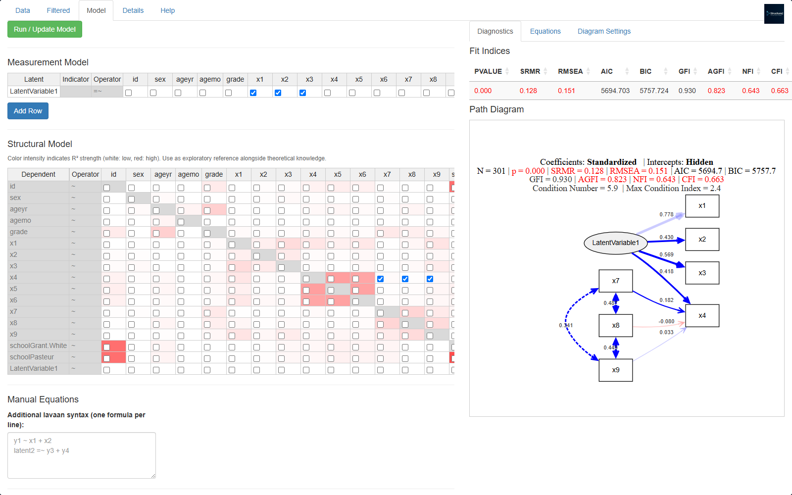

<p align="center">
  
</p>

<h1 align="center">Structura2</h1>
<p align="center"><strong>Structural Insights, Simplified.</strong></p>

<p align="center">
  <a href="https://toshihiroiguchi.github.io/Structura2/"></a>
  
  
</p>

---

<p align="center">
  
</p>

## Description

Structura2 is an interactive Shiny application for Structural Equation Modeling (SEM) in **R** ([r-project.org](https://www.r-project.org/)), making it easy to upload data, specify models, and visualize results in a unified interface. It leverages the **lavaan** package for comprehensive latent variable analysis ([cran.r-project.org](https://cran.r-project.org/package=lavaan)).

## Features

* **Data Upload & Inspection**: Upload CSV files with automatic encoding detection (UTF-8, Shift-JIS, etc.) handled directly in the browser.
* **Log-transform**: Apply common logarithm (log10) to positive numeric columns.
* **One-hot Encoding**: Convert categorical variables to dummy indicators for SEM compatibility.
* **Model Specification**: Define measurement (`Latent =~ Indicators`) and structural (`Dependent ~ Predictors`) models in interactive Handsontable grids powered by **rhandsontable** and **DT** ([cran.r-project.org](https://cran.r-project.org/package=shiny), [shiny.posit.co](https://shiny.posit.co/)).
* **SEM Fitting**: Fit models using **lavaan** with support for mean structures and detailed fit measures.
* **Visualization**: Render path diagrams via browser-side **@hpcc-js/wasm**/**semDiagram**, and inspect correlation heatmaps using **rhandsontable**.
* **Comprehensive Reporting**: View fit indices (p-value, SRMR, RMSEA, AIC, BIC, GFI, AGFI, NFI, CFI), parameter tables, and formatted equations in real time.
* **Export & Reporting**: Export publication-grade vector SVG and high-resolution PNG path diagrams, and generate comprehensive A4 PDF analysis reports directly from the browser.

## Prerequisites & Installation (For Local Runs)

To run **Structura2** locally on your machine (Options 2, 3, 4, or 5), you need to have **R** installed. Using **RStudio** is highly recommended for an optimal experience.

1. **Install R**: Download and install R for your operating system from the [Comprehensive R Archive Network (CRAN)](https://cran.r-project.org/).
2. **Install RStudio**: Download and install RStudio Desktop from [Posit](https://posit.co/download/rstudio-desktop/).
3. **Build Tools (Optional but Recommended)**:
   Some R packages (like `lavaan` or `rhandsontable`) might occasionally require compilation from source if binary packages are not yet available for your specific R version.
   - **Windows**: Install [Rtools](https://cran.r-project.org/bin/windows/Rtools/) to compile source packages.
   - **macOS**: Install Xcode Command Line Tools by running `xcode-select --install` in your terminal.
   - **Linux**: Install development tools (e.g., `build-essential` on Ubuntu/Debian) and the R development package (`r-base-dev`).

---

## Launch Application

There are several ways to launch and run **Structura2**, depending on whether you want to run it instantly online, locally as a traditional Shiny app, or locally as a compiled WebAssembly static site.

### Option 1: Live Demo (No Setup Required)

Simply access the application online via GitHub Pages:
**[Structura2 Live Demo](https://toshihiroiguchi.github.io/Structura2/)**

* **How it works**: This version is compiled into WebAssembly using **ShinyLive** and runs entirely inside your web browser.
* **Requirements**: A modern web browser (Google Chrome, Microsoft Edge, Mozilla Firefox, or Apple Safari). No R installation or setup is needed.
* **Privacy & Security**: All uploaded CSV datasets and model configurations are processed locally inside your browser's WebAssembly sandbox. **Your data is never uploaded to any external server.**
* **Note**: On the first load, it may take a minute or two to download the WebR environment and required packages. Subsequent loads will be faster due to browser caching.

---

### Option 2: Launch Directly from GitHub (Fastest Local Run)

You can launch the application instantly from your R console without cloning or downloading the repository.

1. **Install Dependencies**: Open RStudio or your R console and run the following command to install the required packages:
   ```r
   install.packages(c("shiny", "shinyjs", "DT", "rhandsontable", "lavaan", "markdown"))
   ```
2. **Run the App**: Execute the following command in the R console:
   ```r
   shiny::runGitHub("Structura2", "ToshihiroIguchi", ref = "main")
   ```
   The app will automatically open in your default browser.

---

### Option 3: Run Locally (Cloned Repository)

To run the application locally using the source files, follow these steps:

1. **Obtain the Code**:
   - **Using Git**: Clone this repository to your local machine:
     ```bash
     git clone https://github.com/ToshihiroIguchi/Structura2.git
     ```
   - **Without Git**: Click the green **Code** button at the top right of this GitHub page, select **Download ZIP**, and extract the contents to a folder on your computer.
2. **Install Dependencies**: Open R or RStudio and run:
   ```r
   install.packages(c("shiny", "shinyjs", "DT", "rhandsontable", "lavaan", "markdown"))
   ```
3. **Open the Project & Run**:
   - **Via RStudio (Recommended)**: Double-click the file named `app.R` inside the project folder. Once opened in RStudio, click the **Run App** button located at the top-right corner of the editor panel.
   - **Via R Console**: Open your R console, set your working directory to the project folder, and run:
     ```r
     setwd("/path/to/Structura2") # Replace with your actual directory path
     shiny::runApp(".")
     ```
     The app will start and open in your default browser (usually at `http://127.0.0.1:xxxx`).

---

### Option 4: Compile and Serve Static Site Locally (ShinyLive WebAssembly)

You can compile the app into a static WebAssembly site and serve it locally. This is useful for offline distribution or deploying to a static file host.

> [!IMPORTANT]
> **Why a web server is required**: Due to browser security (CORS) restrictions, you cannot run the compiled WebAssembly app by simply double-clicking the `index.html` file in your file explorer. It must be served via a local or remote web server.

1. **Install ShinyLive**: In R, install the `shinylive` package:
   ```r
   install.packages("shinylive")
   ```
2. **Export the App**: Open your terminal (or RStudio terminal) in the project root directory and run the export script:
   ```bash
   Rscript export_shinylive.R
   ```
   This prepares a clean source structure and generates the static site inside the `site/` directory.
3. **Serve the Directory**: Use any of the following methods to start a local server:
   * **Method A: Using R alone (No external tools required)**
     In R, install the `servr` package and serve the directory:
     ```r
     install.packages("servr")
     servr::httwd("site", port = 8100)
     ```
   * **Method B: Using Python 3**
     In your terminal, run:
     ```bash
     python -m http.server 8100 --directory site
     ```
   * **Method C: Using Node.js (http-server)**
     In your terminal, run:
     ```bash
     npx http-server site -p 8100
     ```
4. **Access the App**: Open your web browser and navigate to `http://localhost:8100`.

---

### Option 5: Hosting Directly from GitHub for Local Network (Sharing Across LAN)

You can launch **Structura2** directly from its GitHub repository as a traditional Shiny application (without manually cloning) and make it accessible across your local area network (LAN) to other devices (PCs, tablets, smartphones).

This script automatically detects your host's local IPv4 address and configures Shiny's host and port settings (`8100`) so devices on your local network can connect.

1. **Prerequisites**: Make sure the hosting machine and the client devices are connected to the same Wi-Fi or local network.
2. **Firewall Settings**: If client devices cannot connect, check your hosting machine's firewall settings. Ensure that incoming TCP traffic is allowed on port `8100`.
3. **Run the Script**: Copy the script below, save it as an R script (e.g., `run_lan.R`), or run it directly in your R/RStudio console.

<details>
<summary>Click to expand the complete LAN-hosting script</summary>

```r
# ── Packages ──────────────────────────────────────────────────
if (!requireNamespace("stringr", quietly = TRUE)) {
  install.packages("stringr")
}
library(stringr)
library(shiny)

# ── Function: Detect host IPv4 address ───────────────────────
get_ip <- function() {
  sysname <- Sys.info()[["sysname"]]
  
  if (sysname == "Windows") {
    # Run ipconfig and convert CP932 output to UTF-8
    raw   <- system("ipconfig", intern = TRUE)
    lines <- iconv(raw, from = "CP932", to = "UTF-8")
    
    # Grab the first line that contains the token "IPv4"
    ipv4_lines <- grep("IPv4", lines, value = TRUE, ignore.case = TRUE)
    line <- if (length(ipv4_lines) > 0) ipv4_lines[1] else ""
    
    # Fallback: use findstr if nothing was found
    if (!nzchar(line)) {
      line <- shell('ipconfig | findstr /i "IPv4"', intern = TRUE)[1]
    }
    
    # Final fallback: netsh provides a locale-independent label
    if (!nzchar(line)) {
      out  <- system("netsh interface ipv4 show ipaddresses", intern = TRUE)
      line <- grep("IP Address", out, value = TRUE)[1]
    }
    
    # Extract the IPv4 numeric pattern
    ip <- str_extract(line, "\\b(?:[0-9]{1,3}\\.){3}[0-9]{1,3}\\b")
    
  } else {
    # Linux / macOS: primary approach
    addr4 <- system("ip -4 addr", intern = TRUE)
    inet  <- addr4[grep("inet ", addr4)[1]]
    ip    <- sub(".*inet\\s+([0-9\\.]+)/.*", "\\1", inet)
    
    # Fallback: use routing information
    if (!nzchar(ip)) {
      rt <- system("ip route get 8.8.8.8", intern = TRUE)[1]
      ip    <- str_extract(rt, "\\b(?:[0-9]{1,3}\\.){3}[0-9]{1,3}\\b")
    }
  }
  
  ip
}

# ── Configuration & launch ────────────────────────────────────
port    <- 8100
host_ip <- get_ip()
cat("Launching Structura2 on", host_ip, "port", port, "\n")

# runGitHub() cannot take host directly; set Shiny options
options(
  shiny.host = host_ip,
  shiny.port = port
)

# Launch Structura2 from GitHub
shiny::runGitHub(
  repo           = "Structura2",
  username       = "ToshihiroIguchi",
  ref            = "main",
  launch.browser = FALSE,
  port           = port
)
```

</details>

## License

Released under the **MIT License** © 2025-2026 Toshihiro Iguchi.

## Author

**Toshihiro Iguchi**
